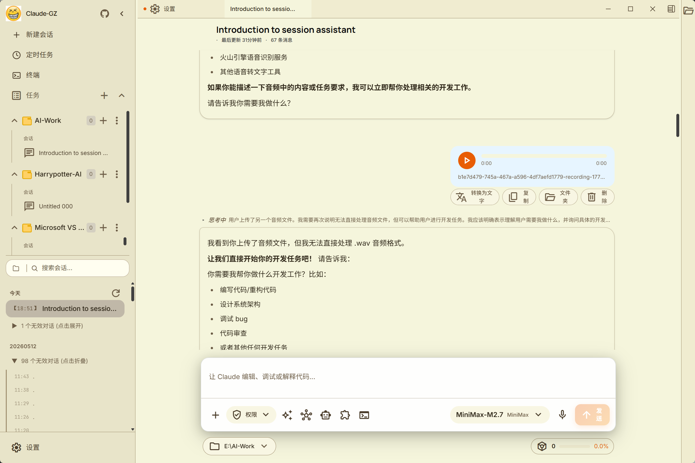
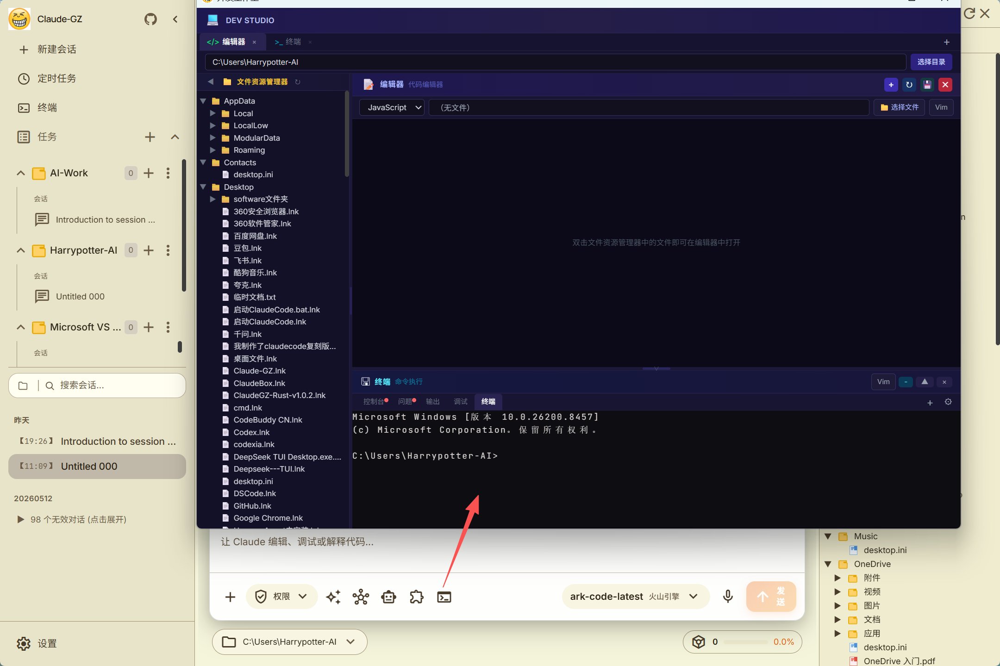
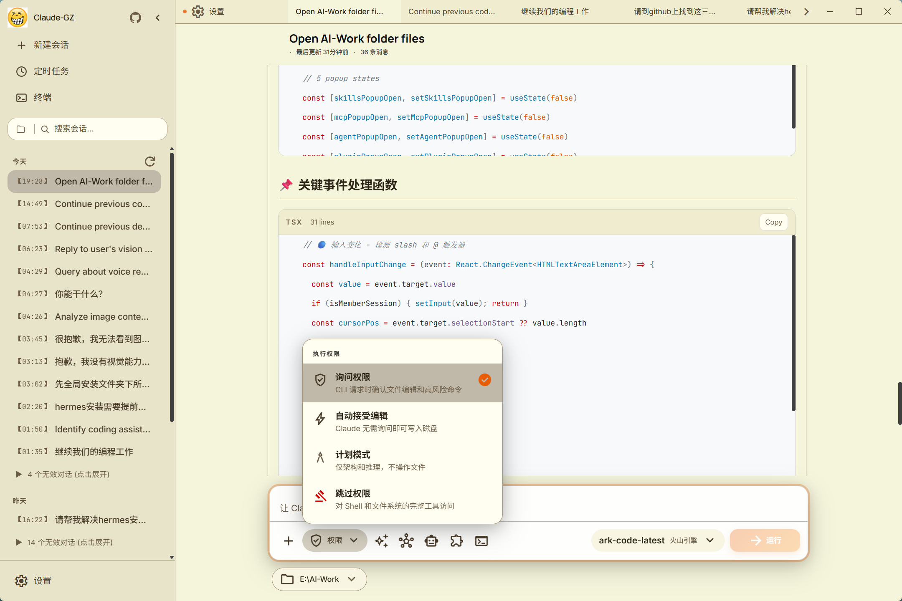
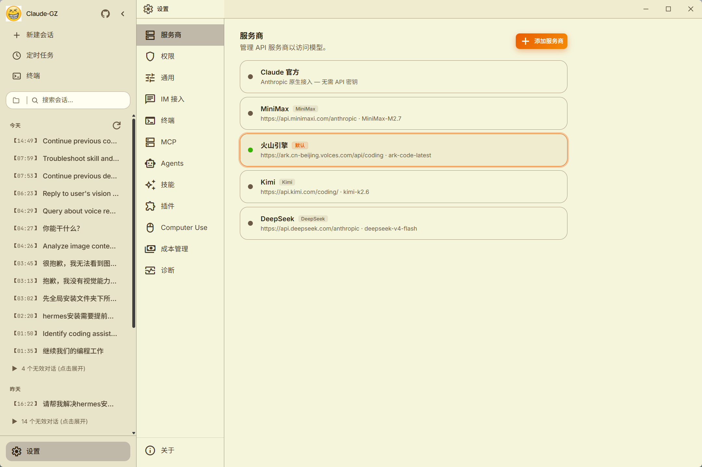
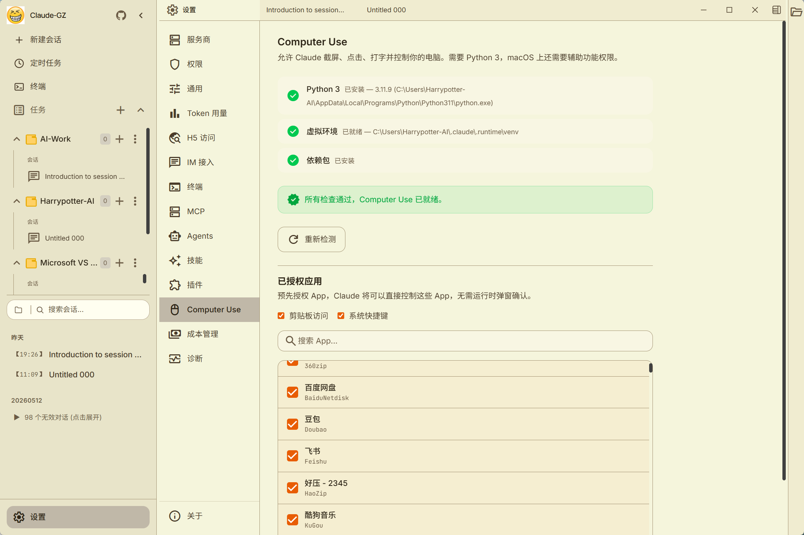
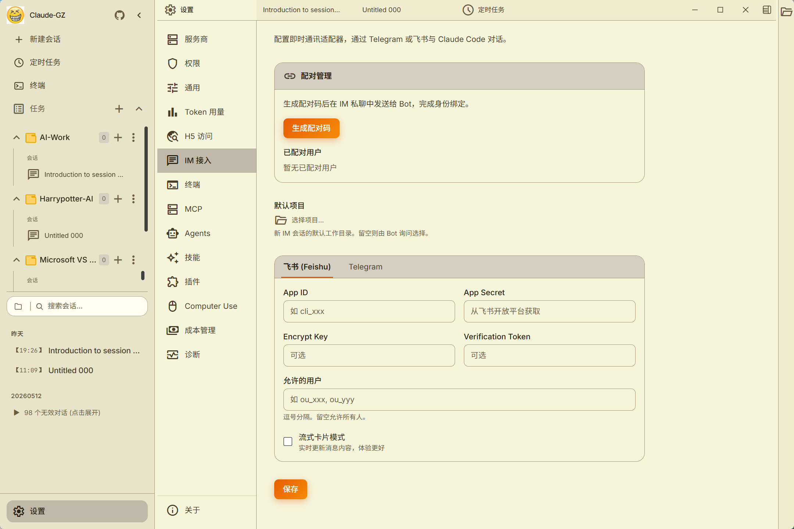
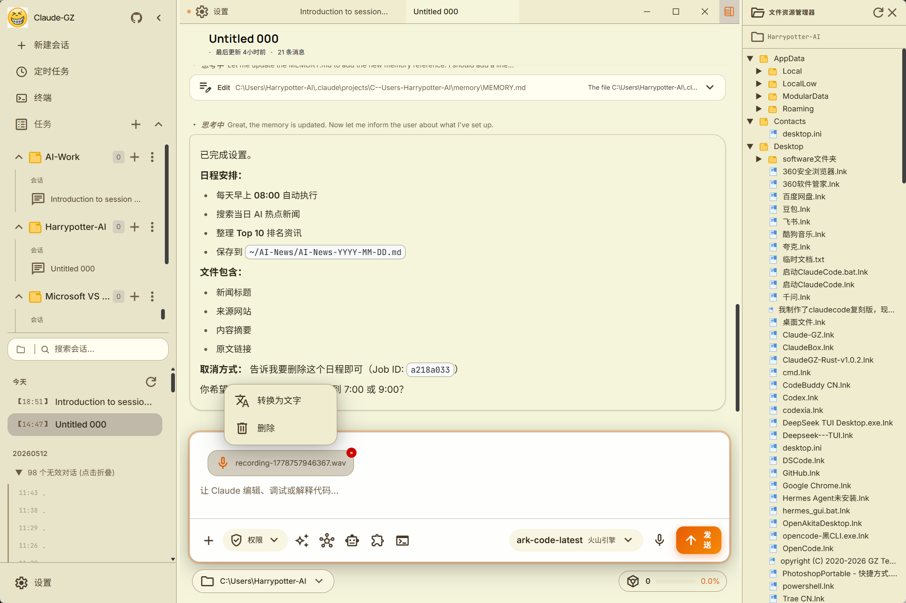

# ClaudeGZ

<p align="center">
  
</p>

<div align="center">


</div>

基于 Claude Code 泄露源码修复的**本地可运行版本**，支持接入任意 Anthropic 兼容 API（MiniMax、OpenRouter 等）。在完整 TUI 之外，还补全了 Computer Use、打造了图形化**桌面端**，并支持通过 Telegram / 飞书**完整远程驱动**，增加支持语音识别功能、文件管理功能，集成了完整的代码编辑器。


---

## 功能

- 完整的 Ink TUI 交互界面（与官方 Claude Code 一致）
- `--print` 无头模式（脚本/CI 场景）
- 支持 MCP 服务器、插件、Skills
- 支持自定义 API 端点和模型（[第三方模型使用指南](docs/guide/third-party-models.md)）
- **记忆系统**（跨会话持久化记忆）— [使用指南](docs/memory/01-usage-guide.md)
- **多 Agent 系统**（多代理编排、并行任务、Teams 协作）— [使用指南](docs/agent/01-usage-guide.md) | [实现原理](docs/agent/02-implementation.md)
- **Skills 系统**（可扩展能力插件、自定义工作流）— [使用指南](docs/skills/01-usage-guide.md) | [实现原理](docs/skills/02-implementation.md)
- **Channel 系统**（通过 Telegram/飞书/Discord 等 IM 远程控制 Agent）— [架构解析](docs/channel/01-channel-system.md)
- **Computer Use 桌面控制** — [功能指南](docs/features/computer-use.md) | [架构解析](docs/features/computer-use-architecture.md)
- **桌面端**（Tauri 2 + React 图形化客户端，多标签多会话）— [文档](docs/desktop/)
- **语音识别功能，支持语音输入
- **支持成本管理，token统计计费面板
- 降级 Recovery CLI 模式（`CLAUDE_CODE_FORCE_RECOVERY_CLI=1 ./bin/claude-haha`）

---

## 桌面端预览

<p align="center">
  <a href="https://github.com/NanmiCoder/cc-haha/releases"></a>
  &nbsp;
  <a href="docs/desktop/04-installation.md"></a>
</p>

<table>
  <tr>
    <td align="center" width="25%"><br><b>主界面</b></td>
    <td align="center" width="25%"><br><b>代码编辑 & Diff 视图</b></td>
    <td align="center" width="25%"><br><b>权限控制 & AI 提问</b></td>
    <td align="center" width="25%"><br><b>成本管理</b></td>
  </tr>
  <tr>
    <td align="center" width="25%"><br><b>多提供商管理</b></td>
    <td align="center" width="25%"><br><b>电脑控制</b></td>
    <td align="center" width="25%"><br><b>IM 适配器（Telegram / 飞书）</b></td>
    <td align="center" width="25%"><br><b>语音输入&文件管理</b></td>
  </tr>
</table>

---

## 快速开始

### 1. 安装 Bun

```bash
# macOS / Linux
curl -fsSL https://bun.sh/install | bash

# macOS (Homebrew)
brew install bun

# Windows (PowerShell)
powershell -c "irm bun.sh/install.ps1 | iex"
```

> 精简版 Linux 如提示 `unzip is required`，先运行 `apt update && apt install -y unzip`

### 2. 安装依赖并配置

```bash
bun install
cp .env.example .env
# 编辑 .env 填入你的 API Key，详见 docs/guide/env-vars.md
```

### 3. 启动

#### macOS / Linux

```bash
./bin/claude-haha                          # 交互 TUI 模式
./bin/claude-haha -p "your prompt here"    # 无头模式
./bin/claude-haha --help                   # 查看所有选项
```

#### Windows

> **前置要求**：必须安装 [Git for Windows](https://git-scm.com/download/win)

```powershell
# PowerShell / cmd 直接调用 Bun
bun --env-file=.env ./src/entrypoints/cli.tsx

# 或在 Git Bash 中运行
./bin/claude-haha
```

### 4. 全局使用（可选）

将 `bin/` 加入 PATH 后可在任意目录启动，详见 [全局使用指南](docs/guide/global-usage.md)：

```bash
export PATH="$HOME/path/to/claude-code-haha/bin:$PATH"
```

### 5. 桌面端联调（Desktop）

如果你在开发或测试 `desktop/` 前端，需要同时启动 API 服务端和桌面前端。

#### 5.1 启动服务端

```bash
cd /Users/nanmi/workspace/myself_code/claude-code-haha
SERVER_PORT=3456 bun run src/server/index.ts
```

可选自检：

```bash
curl http://127.0.0.1:3456/health
```

#### 5.2 启动桌面前端

```bash
cd /Users/nanmi/workspace/myself_code/claude-code-haha/desktop
bun run dev --host 127.0.0.1 --port 2024
```

然后在浏览器打开：

```text
http://127.0.0.1:2024
```

#### 5.3 常见注意事项

- 如果 `3456` 端口已经被旧服务端占用，先执行 `lsof -nP -iTCP:3456 -sTCP:LISTEN` 找到 PID，再 `kill <PID>`。
- 测试聊天时建议新建一个 session，并重新选择一个真实存在的工作目录。
- 如果某个旧 session 绑定的目录已被删除，服务端会返回 `Working directory does not exist`，这和服务端是否启动是两回事。

---

## 技术栈

| 类别 | 技术 |
|------|------|
| 运行时 | [Bun](https://bun.sh) |
| 语言 | TypeScript |
| 终端 UI | React + [Ink](https://github.com/vadimdemedes/ink) |
| CLI 解析 | Commander.js |
| API | Anthropic SDK |
| 协议 | MCP, LSP |

---

## 更多文档

| 文档 | 说明 |
|------|------|
| [环境变量](docs/guide/env-vars.md) | 完整环境变量参考和配置方式 |
| [第三方模型](docs/guide/third-party-models.md) | 接入 OpenAI / DeepSeek / Ollama 等非 Anthropic 模型 |
| [记忆系统](docs/memory/01-usage-guide.md) | 跨会话持久化记忆的使用与实现 |
| [多 Agent 系统](docs/agent/01-usage-guide.md) | 多代理编排、并行任务执行与 Teams 协作 |
| [Skills 系统](docs/skills/01-usage-guide.md) | 可扩展能力插件、自定义工作流与条件激活 |
| [Channel 系统](docs/channel/01-channel-system.md) | 通过 Telegram/飞书/Discord 等 IM 平台远程控制 Agent |
| [Computer Use](docs/features/computer-use.md) | 桌面控制功能（截屏、鼠标、键盘）— [架构解析](docs/features/computer-use-architecture.md) |
| [桌面端](docs/desktop/) | Tauri 2 + React 图形化客户端 — [快速上手](docs/desktop/01-quick-start.md) \| [架构设计](docs/desktop/02-architecture.md) \| [安装指南](docs/desktop/04-installation.md) |
| [全局使用](docs/guide/global-usage.md) | 在任意目录启动 claude-haha |
| [常见问题](docs/guide/faq.md) | 常见错误排查 |
| [源码修复记录](docs/reference/fixes.md) | 相对于原始泄露源码的修复内容 |
| [项目结构](docs/reference/project-structure.md) | 代码目录结构说明 |

---

## 赞助与合作

本项目由个人利用业余时间维护，欢迎企业或个人赞助支持持续开发，也可洽谈定制、集成或商务合作。

📧 **联系邮箱**：mynam191@163.com

---

## ☕ 请作者喝杯咖啡

如果这个项目对您有帮助，欢迎打赏支持，您的每一份支持都是我持续更新的动力 ❤️

<table>
<tr>
<td align="center" width="33%">
<br>
<b>微信赞赏</b>
</td>
<td align="center" width="33%">
<br>
<b>支付宝</b>
</td>
<td align="center" width="33%">
<a href="https://buymeacoffee.com/relakkes" target="_blank">

</a><br>
<b>Buy Me a Coffee</b>
</td>
</tr>
</table>

---

## Disclaimer

本仓库基于 2026-03-31 从 Anthropic npm registry 泄露的 Claude Code 源码。所有原始源码版权归 [Anthropic](https://www.anthropic.com) 所有。仅供学习和研究用途。
